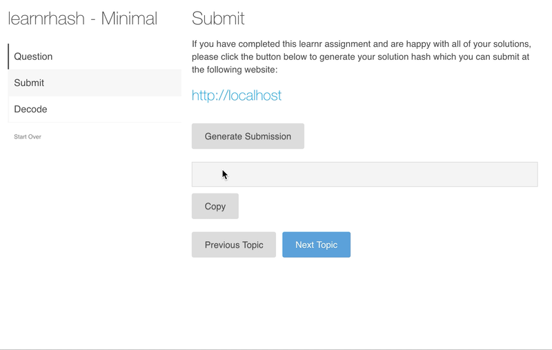

# learnrhash

<!-- badges: start -->

[](https://github.com/rundel/learnrhash/actions)
[](https://www.tidyverse.org/lifecycle/#experimental)
<!-- badges: end -->

## Installation

This package is still in the early stages of development and currently
is only available from GitHub. To install the development version run
the following:

``` r
# install.packages("devtools")
devtools::install_github("rundel/learnrhash")
```

## Usage

This package is meant to provide addition tools for collection student
answers to [learnr](https://rstudio.github.io/learnr/) tutorials. The
package does not transmit the answers in any way, but instead provides a
convenient method to generate a compressed text based representation
that can be easily copied and pasted. The students can then submit these
solutions by pasting this “hash” into an online web form (e.g. Google
Forms, Microsoft Forms, etc.) or a learning management system quiz or
assignment tool.

To enable this functionality, all you need to do is include the
following in a learnr Rmd document:

    ## Submit
    
    ```{r context="server"}
    learnrhash::encoder_logic()
    ```
    
    ```{r encode, echo=FALSE}
    learnrhash::encoder_ui()
    ```

which results in the Submit topic appearing in the tutorial with all of
the necessary shiny logic and ui inserted, as shown below.



In the example above a url for <http://localhost> given, this value can
be replaced with whatever link you would like to use for submission. All
the students will need to do is to paste the generated hash into a text
response field on whatever web form you choose to use.

## Working with Hashes

The expectation is that after students submit their solutions you will
be able to obtain some tabular representation of these results that can
be read into R as a data frame. The package includes a simple example of
this type of data which is loaded as follows

``` r
example = readRDS(system.file("example.rds", package="learnrhash"))
example
```

    ## # A tibble: 2 x 3
    ##   student student_id hash                                                       
    ##   <chr>        <dbl> <chr>                                                      
    ## 1 Colin        20000 QlpoOTFBWSZTWeVuJ2oAA0d/gP/7aAhoC7BViyIOyr/v/+BAAcACsAS7C1…
    ## 2 Mine         10000 QlpoOTFBWSZTWYeyPVYAA0x/gP/7aAhoC7BVgyIOyr/v/+BAAcACsAdqC1…

Currently the package provides two functions for extracting question
solutions and exercise solutions from these hashed data, for both
functions the only required argument is the name of the column
containing the hashed solutions

To extract the questions,

``` r
learnrhash::extract_questions(example, hash)
```

    ## # A tibble: 6 x 6
    ##   student student_id correct question_id   question_text                answer  
    ##   <chr>        <dbl> <lgl>   <chr>         <chr>                        <list>  
    ## 1 Colin        20000 FALSE   details       Student Identifier:          <chr [1…
    ## 2 Colin        20000 FALSE   not_a_planets Which of the following are … <chr [2…
    ## 3 Colin        20000 TRUE    planets       Which planet do we live on?  <chr [1…
    ## 4 Mine         10000 FALSE   details       Student Identifier:          <chr [1…
    ## 5 Mine         10000 TRUE    not_a_planets Which of the following are … <chr [3…
    ## 6 Mine         10000 TRUE    planets       Which planet do we live on?  <chr [1…

To extract the exercises,

``` r
learnrhash::extract_exercises(example, hash)
```

    ## # A tibble: 4 x 7
    ##   student student_id exercise_id code      feedback         checked correct
    ##   <chr>        <dbl> <chr>       <chr>     <list>           <lgl>   <lgl>  
    ## 1 Colin        20000 code        "1+1\n\n" <NULL>           FALSE   NA     
    ## 2 Colin        20000 code2       "1+1\n\n" <named list [4]> TRUE    TRUE   
    ## 3 Mine         10000 code        "1+1\n\n" <NULL>           FALSE   NA     
    ## 4 Mine         10000 code2       "1+1\n\n" <named list [4]> TRUE    TRUE

If you would like to experiment with this decoding and extraction while
writing your tutorial you can also include decoding logic and ui
elements into the tutorial in a similar way that the encoder was
included. Simply add the following lines into your Rmd,

    ## Decode
    
    ```{r context="server"}
    learnrhash::decoder_logic()
    ```
    
    ```{r encode, echo=FALSE}
    learnrhash::decoder_ui()
    ```


These lines should be removed from the document before posting the
tutorial is distributed to students.
